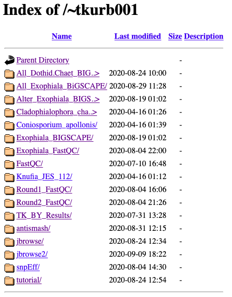

JBrowse - Genome Browser
=====

Written by: Tania Kurbessoian [@tania-k](https://github.com/tania-k)

To visualize genome annotation combined with Epigenomic, Transcriptomic, or Variant data you you want to visualize them onto a genome browser.  [JBrowse](https://jbrowse.org) provides an easy to setup tool for this visuzalition.

There is substantial [documentation](https://jbrowse.org/docs/installation.html) that describes installation and add-on features. The [FAQ](https://jbrowse.org/docs/faq.html) is also incredibly helpful. 

# Setup JBrowse on HPCC

These steps will show you how to setup JBrowse on HPCC with some already installed systems to make it easier for you


### Configure your HPCC account to be able to share via HTTP / Web

First you need to configure your account to be able to share data via the web.

Follow the [directions on the HPCC manual](http://hpcc.ucr.edu/manuals_linux-cluster_sharing.html#sharing-files-on-the-web) so that you can configure your home folder `~/.html` to be able to serve up data. If you do not want to make everything in this folder public you can use some simple strategies to enable a password protected space by [creating a `.htaccess`](http://hpcc.ucr.edu/manuals_linux-cluster_sharing.html#password-protect-web-pages) file or you can use a web form of security - security through obscurity.

```
mkdir ~/.html/private
chmod 711 ~/.html/private
mkdir ~/.html/private/MYSECRETPROJECT
# install jbrowse or data or others in ~/.html/private/MYSEKR1TPROJECT
```
On the web a user browsing will not have permission to see `https://cluster.hpcc.ucr.edu/~YOURUSERNAME/private` but the URL `https://cluster.hpcc.ucr.edu/~YOURUSERNAME/private/MYSEKR1TPROJECT` will be visible.  This is called security by obscurity, if you generate a long random string instead of `MYSEKR1TPROJECT` it would be hard to guess it (though note this not really secure since anyone reading network traffic and see the string would now know the the URL to go to). Generally if you want to protect the data, setup a `.htaccess/.htpasswd` to require logging in.

## Setting up your own copy of JBrowse software from scratch 

(some of this was not working well unless you add `module load python` which is really just loading other hpcc modules.)

Use [git](https://git-scm.com/) to clone a copy of the software into `~/bigdata/` folder.  (20 seconds)
```
cd ~/bigdata
git clone https://github.com/gmod/jbrowse
```

## Using already setup JBrowse environment

There are several ways to install JBrowse - it could be you are running this on your own laptop/server or other location. The next directions are specific to the UCR HPCC.
These instructions use an already build conda environment which you can link to:

```

cd ~/.html/private
ln -s ~/bigdata/jbrowse
cd jbrowse
mv bin bin-jbrowse-git
module load jbrowse
JBROWSE_PATH=$(dirname `which biodb-to-json.pl`)
ln -s $JBROWSE_PATH ./
```

Initially I had this jbrowse folder in my `~/.html/` directory but because on [HPCC](https://hpcc.ucr.edu) home directory is limited in space I made a symlink to the data folder in bigdata. So jbrowse folder is located in my `~/bigdata/` folder. Then from home I did the following to create the symlink.
```
cd  ~/.html/ 
ln -s ~/bigdata/jbrowse # this way I have more space to play with.
cd jbrowse 
git checkout 1.16.9-release # In the jbrowse folder checkout the specific release, later you can update this with a git pull and git checkout NEW-RELEASE
```

## Alternatively - setup "nodejs" conda environment

Basically configurations and packages to set up javascript environments.
If you don’t have this conda environment up yet, make sure to set it up with:
First create the environment- since you are creating this in your own folder it will create an environment in `~/.conda`. But since we have limited space in the Home directory it is useful to do the following to move or create a .conda in bugdata.

If no `~/.conda` exists then
```
cd ~
mkdir ~/bigdata/conda
ln -s ~/bigdata/conda .conda
```
If `~/.conda` already exists but isn't a symlink into ~/bigdata then
```
mv ~/.conda ~/bigdata/conda
ln -s ~/bigdata/conda ~/.conda
```

Now create the nodejs conda environment.
```
module load miniconda3
# create a new environment; install perl, libgdb, nodejs conda packages
conda create -n nodejs -c conda-forge -c bioconda libgd nodejs npm
source activate nodejs # Then activate the newly created environment.
```

Now run the JBrowse setup (this will take 10 minutes to run):
```
cd ~/.html/jbrowse
./setup.sh 
```
Running a quick ls -l on your path should show you this.

{:.img-fluid}

Check and see if the site has loaded on the HPCC hosted website. Here is my [cluster page - https://cluster.hpcc.ucr.edu/~tkurb001/](https://cluster.hpcc.ucr.edu/~tkurb001/)
{:.img-fluid}

Click on jbrowse2 to take you to the created page. This is my example run, your html link should be https://cluster.hpcc.ucr.edu/~YOURUSERNAME/ 

This will take a couple of seconds. It will say "Loading..." 
Once done it should say,   "Congratulations! JBrowse is now on the web!"

Though you have no data loaded in so it’ll give you an error. You can look at the volvox dataset they have preinstalled. 
But now you can start setting up your own browser!


# Now let’s set up the browser!
Following the [directions in this tutorial](https://jbrowse.org/docs/tutorial.html).
```
mkdir -p data # this is where all your files will live.
cd data
ln -s /folder/to/your/genome.fasta # Symlink your annotated fasta file into your data folder.
module load samtools
samtools faidx genome.fasta # to create your indexed fasta file.
```
Now in order to have this appear on your browser you need to edit a file. JBrowse gives you two options to edit an html file or just a text configuration file. 
```
trackList.json - html file
tracks.conf - text file
```

Its easier to work on the tracks.conf text file.
You can edit the text file through nano, vi, emacs - this file will be created in the `data/` directory of your jbrowse install.

## Add Reference Fasta File into your Browser

Now that you have your reference file and it’s indexed add this to your `tracks.conf` file. Replace my sequence names with yours. 
```yaml
[GENERAL]
refSeqs=Exophiala_dermatitidis_Ex4.fa.fai

[tracks.refseq]
urlTemplate=Exophiala_dermatitidis_Ex4.fa
storeClass=JBrowse/Store/SeqFeature/IndexedFasta
type=Sequence
```


## Add GFF3 file into your Browser

To add GFF files to your system you will need to provide a sorted, bgzip compressed file.
Here's a general purpose script you can use - save it as ~/bin/sort_compress_gff3.sh or use the one I have copied into 
```bash
#!/usr/bin/bash
module load bcftools

GFF=$1
if [ -z $GFF ]; then
	echo "No GFF file as input"
	exit
fi
BASE=$(echo $GFF | perl -p -e 's/\.(gff3|gtf)?$//')
(grep ^"#" $GFF; grep -v ^"#" $GFF | grep -v "^$" | grep "\t" | sort -k1,1 -k4,4n) | bgzip -c > $GFF.gz
tabix -p gff $GFF.gz
```

You can also add in a gff3 file. Add this to tracks.conf file
```
[tracks.genes]
urlTemplate=Exophiala_dermatitidis_Ex4.sorted.gff3.gz
storeClass=JBrowse/Store/SeqFeature/GFF3Tabix
type=CanvasFeatures
```

## Add BAM files into your Browser
Let’s add in your BAM files. Again just symlink your BAM files from wherever they are into the data file. Unfortunately the cluster disallows the BAM files to appear on the browser due to a feature. A way to deactivate that is:

In your data folder you should create the file `.htaccess.` 
It may be created on its own or you may have to create one yourself. If not add this into your `.htaccess` file. Edit this file with nano,vi,emacs `nano .htaccess`
```
# This Apache .htaccess file is generated by JBrowse (GenomeDB) for
# allowing cross-origin requests as defined by the Cross-Origin
# Resource Sharing working draft from the W3C
# (http://www.w3.org/TR/cors/).  In order for Apache to pay attention
# to this, it must have mod_headers enabled, and its AllowOverride
# configuration directive must allow FileInfo overrides.
<IfModule mod_headers.c>
    AddType application/octet-stream .bam .bami .bai
    Header onsuccess set Access-Control-Allow-Origin *
    Header onsuccess set Access-Control-Allow-Headers X-Requested-With,Range
    Header onsuccess set Access-Control-Expose-Headers Content-Length,Content-Range
</IfModule>
```

In order to get the bam files to appear on your browser add this to tracks.conf file. Make the adjustments to represent your data, and change the metadata description to your choosing.
```
[ tracks . EX1_bam ]
style.height = 7
key = BAM - Ex1-sorted.bam
storeClass = JBrowse/Store/SeqFeature/BAM
urlTemplate = Ex1.realign.sorted.bam
maxFeatureScreenDensity = 4
metadata.category = BAM
metadata.Description = BAM-format alignments of simulated resequencing reads on Ex1
type = JBrowse/View/Track/Alignments2
renderAlignment = true
```

If you have more than one file they should look like this:
```
[ tracks . EX2_bam ]
style.height = 7
key = BAM - Ex2-sorted.bam
storeClass = JBrowse/Store/SeqFeature/BAM
urlTemplate = Ex2.realign.sorted.bam            
maxFeatureScreenDensity = 4
metadata.category = BAM
metadata.Description = BAM-format alignments of simulated resequencing reads on Ex2                            
type = JBrowse/View/Track/Alignments2
renderAlignment = true
```
Add VCF files into your Browser
====
Follow the suggestions for your files, adjust the names and you’re good to go.
Now if you want to add vcf files, again symlink them into your data file. And add this to your tracks.conf file. 
```
[tracks. INDEL_VCF]
style.height = 7
storeClass=JBrowse/Store/SeqFeature/VCFTabix
urlTemplate=Exophiala.Run1.selected.INDEL.vcf.gz
maxFeatureScreenDensity = 4
metadata.category = VCF
type = JBrowse/View/Track/CanvasVariants
key = VCF - INDEL

[tracks.SNP_VCF]
style.height = 7
storeClass=JBrowse/Store/SeqFeature/VCFTabix
urlTemplate=Exophiala.Run1.selected.SNP.vcf.gz
maxFeatureScreenDensity	= 4
metadata.category = VCF
type = JBrowse/View/Track/CanvasVariants
key = VCF - SNPs
```

I’ve added a track for both SNPs and INDELs. If you’ve run Jason’s full GATK pipeline you’ll get these two files from snpEff. I’ve added the bgzip compressed files `Exophiala.Run1.selected.INDEL.vcf.gz` and `Exophiala.Run1.selected.SNP.vcf.gz`.

If you have `.vcf` files that are not compressed you can compress them with:
```
module load bcftools
bgzip FILE.vcf
```
 You should also index these files using:
```
module load bcftools
tabix -p vcf my_file.vcf.gz
```

I recommend you `chmod 755 data/` folder and also all the files that exist in the `data/` file (`chmod a+r data/*`)
Now refresh your page and your browser should appear!

If you would like to view my working browser go back to my html page with the different folders. Click on the `jbrowse` link to view my genome browser for Exophiala dermatitidis. 

Good luck!

-T
