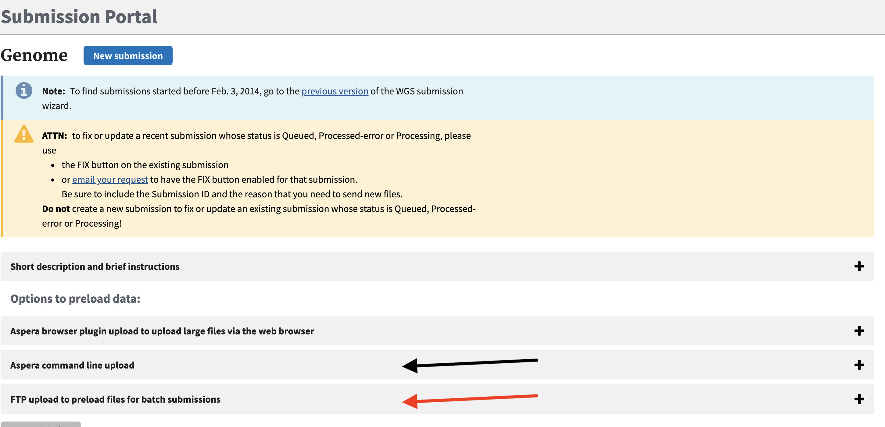
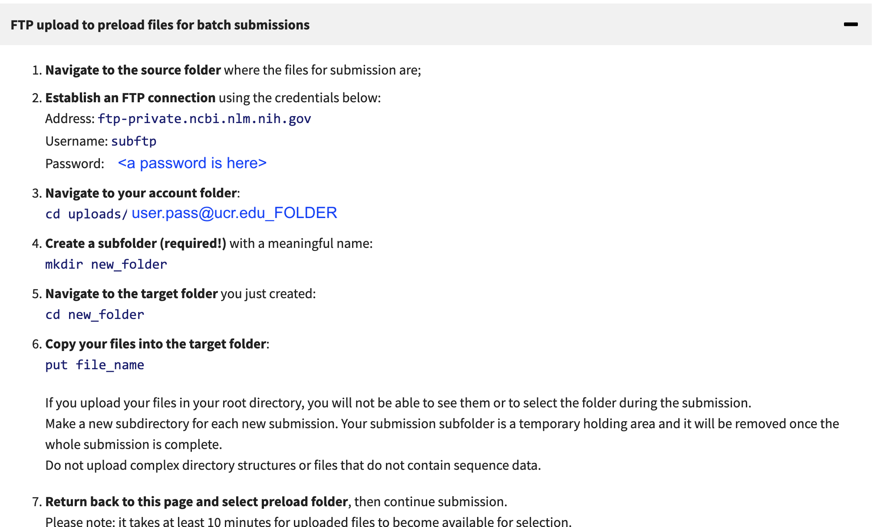
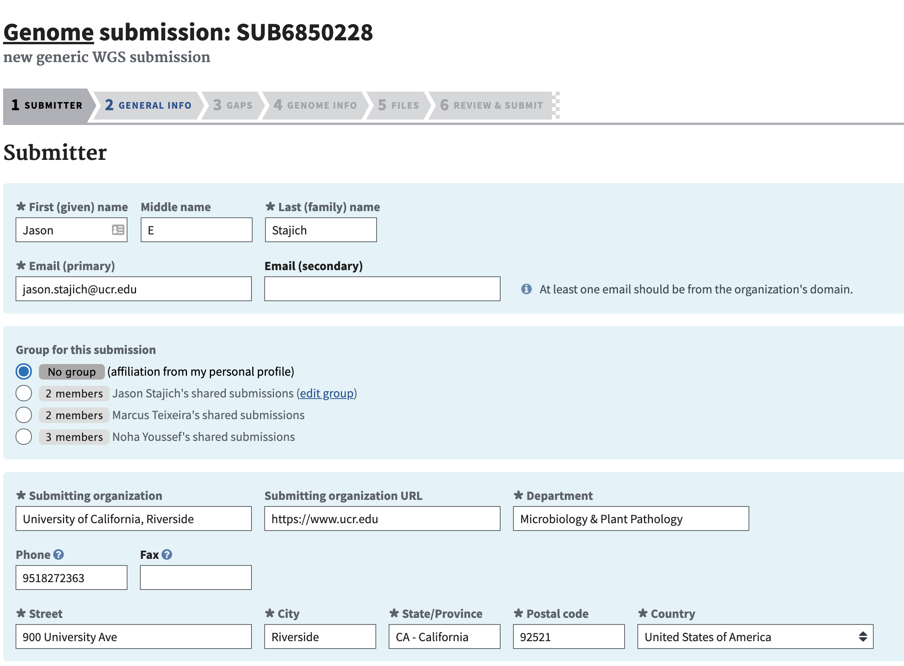
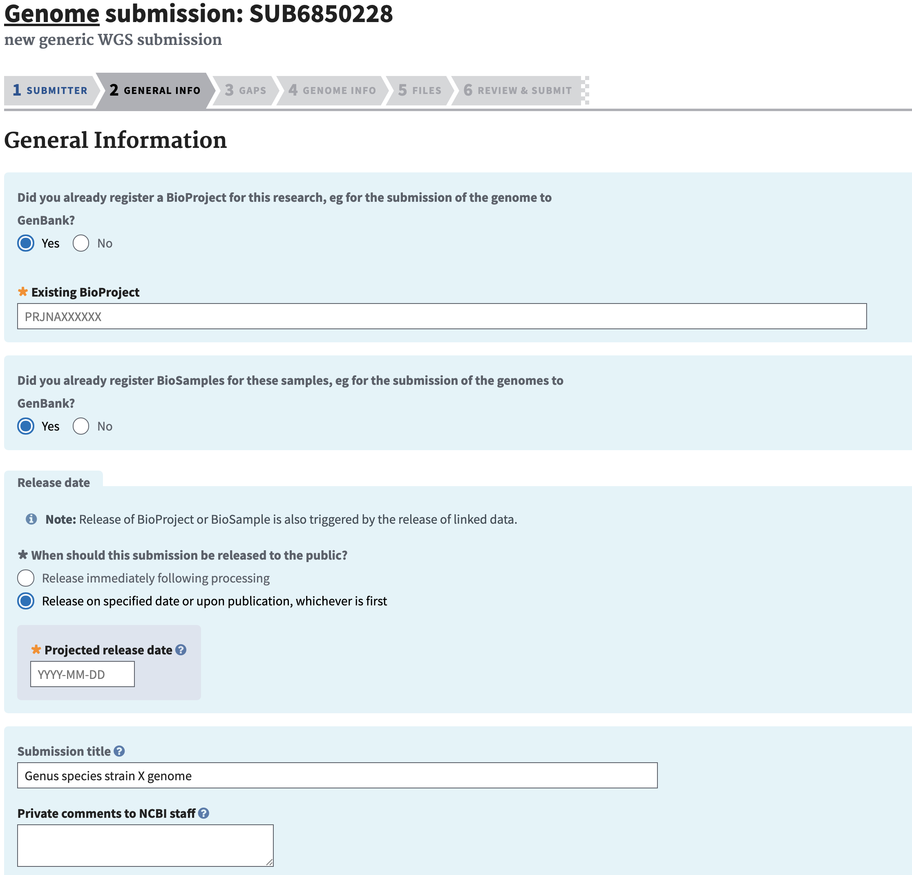

# Creating A BioProject

BioProjects are summary records for individual or multiple genome, amplicon, or transcriptome datasets. BioProjects can also be organized as umbrella projects so that a single BioProject refers to multiple other bioprojects. Data can be assocated with a Bioproject like Samples, SRA records, Genomes, and Publications. BioSamples are individual project and can be organized 1:1 for a single strain genome and a single Bioproject. Or as a multi-sample project which can be multiple samples from the same species (population genomics) and in fact multiple species. A single biosample can also be associated with multiple BioProjects where appropriate.

One important aspect is __Locus Prefix__. Make sure you have checked that box as we will use that as part of annotation steps. If you forget to check this you can request it by email from ncbi curators - see the email at the bottom of the bioproject page for your record.

Generally I don't see a problem making a BioProject public right away, but some prefer to wait until they are ready to release their data publically. Generally you can embargo genome and SRA records even if a BioProject is public.

{:.img-fluid}

# Creating BioSamples

A BioSample record is needed for each biological sample of material that was used. For example a sample to represent the strain where DNA was prepared from. It is not necessary to make a separate biosample if the same strain was grown several times and sequenced more than once (eg a Nanopore and Illumina run). It is typical for labs using the same strain to still deposit a biosample for each of these to reflect there may be some evolution of strains throughout.  However for RNA sequencing or any other control/treatment experiments each sample will need a separate biosample in order to associate the conditions of the sample.

# Depositing data in NCBI

To deposit raw data from sequencing projects in NCBI SRA or from annotation and assembly projects we stage the data in an upload from [HPCC](https://hpcc.ucr.edu). You can also do direct uploads via NCBI web interface which will use aspera if you choose, however the data must then be local to your desktop/laptop.  To avoid copying the data first to your computer can simply direct upload these data from the cluster/linux machines where your analyses were are performed.

To stage data with an upload to the NCBI upload site we use a command line tool. It can be done with regular FTP upload.
However for larger dataset using [Aspera](https://www.ncbi.nlm.nih.gov/books/NBK242625/) is better as it is a faster upload mechanism which utilizes a parallel networking technology called [FASP](https://en.wikipedia.org/wiki/Fast_and_Secure_Protocol). It can achieve upload speeds 10-50x faster than typical single FTP upload speeds so for large Illumina datasets this is critical.

To do an upload you need to use  out your unique folder associated with your NCBI account you need to go to [NCBI submission] (https://submit.ncbi.nlm.nih.gov/subs/genome/) site and click on either the Aspera command line or FTP menu.
{:.img-fluid}

{:.img-fluid}

```
module load aspera
# (all one line)
ascp -i $ASPERAKEY -QT -l500m -k1
-d <path/to/folder/containing files/>
subasp@upload.ncbi.nlm.nih.gov:uploads/YOUREMAIL_XXXX/PRJYYY
```

Alternatively to use FTP you can use ftp client.
```
# lftp is easy and can be put in the background
lftp subftp@ftp-private.ncbi.nlm.nih.gov
password: <put in your password>
> cd uploads/UNIQUE_PATH_FROM_NCBI_PAGE
> mput *.fastq.gz
```

These data are pulled in by the NCBI in the upload process, but it will take 10-15 minutes once you have uploaded the data. If you have datasets that are associated with different upload projects (eg Genome 1, Genome 2, Amplicon data set 2) make a folder for each genome dataset because during the submission upload you will select a folder to associate with a submit. I usually make a folder based on each Bioproject - so the upload folder name can be in the upload name (since it will have the bioproject name) `subasp@upload.ncbi.nlm.nih.gov:uploads/YOUREMAIL_XXXX/BIOPROJECTXX`.

{:.img-fluid}

{:.img-fluid}

# SRA deposition

Amplicon data

## Raw DNA Sequence

Illumina data

PacBio and Nanopore

These are also similar to Illumina data deposition. Just FASTQ files can be desposited. However fast5 files are also


## Raw RNA and Epigenomic data deposition

It is more typical to upload RNAseq data through the [Gene Expression Ombnibus](https://www.ncbi.nlm.nih.gov/geo/) (GEO). GEO will take uploaded raw data as well as computed gene expression data. It can also take ChIP-Seq Epigenomics

# Genome deposition

Raw assemblies.

## Annotated genomes

For Bacteria there is a simple way to get these annotations and genome deposited in one go. Simply use the [PGAP](https://www.ncbi.nlm.nih.gov/genome/annotation_prok/) procedure.  The Genome submission portal is still used for uploading but then an option to annotate

If you would like to annotate a genome with PGAP before depositing you can also download and run [PGAP locally](https://github.com/ncbi/pgap).

# Assembled Transcriptomes

Use the Transcriptome Sequence Archive (TSA). These will still require a minimum length sequence filtering.
